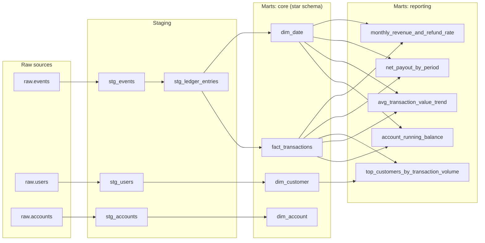

# LedgerOne dbt lineage

Generated from `target/manifest.json` after `dbt docs generate` (dbt 1.8.9 / dbt-duckdb 1.8.4).
This is a static export of the same DAG the interactive `dbt docs serve` lineage graph shows —
regenerate it any time with `dbt docs generate` and re-run the extraction snippet in the repo README
if models change.

